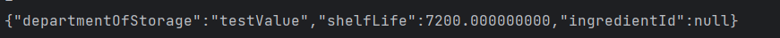

De ingredientenpagina lijkt alle CRUD acties te ondersteunen
Voor het bewerken gaan we naar een andere pagina.  Dit kan ongewenst zijn.

1)  ControllrAdvice
2) Validatie
3) xml file
4) Errors loggen

